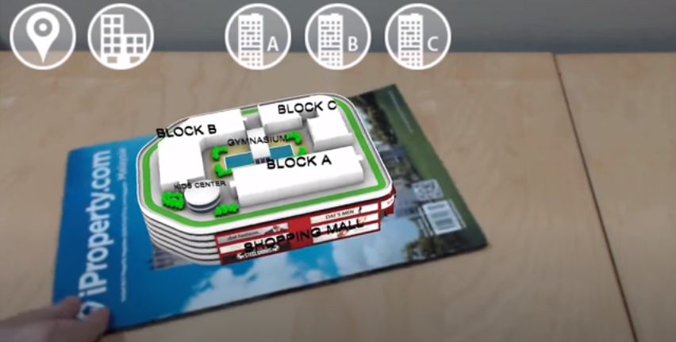

# Review-Teknologi-AR

Kali ini saya akan memberikan penjelasan hasil review saya tentang teknologi augmented reality di bidang usaha. Salah satu project yang menarik adalah AR(Architecture), aplikasi ini dibuat oleh salah satu pengembang aplikasi augmented reality asal malaysia (DAT STUDIO). Aplikasi ini menggunakan library marker base target image unutk memvisualisasikan project bangunan (bisa gedung, rumah, toko dll) sehingga saat menawarkan kepada klien cukup dengan marker kemudian di scan dengan kamera maka akan muncul tampilan 2d/3d bentuk dan desainnya (baik eksterior maupun interiornya) secara detail.

Jumlah kamar, luas, letak dan tinggi bangunan bisa divisualisasikan. sehingga menjadi peuang besar di bidang ekonomi dan bisnis. bahkan bisa dikembang untuk membuat e-commerce dengan memanfaatkan teknologi AR, misal ingin membeli lemari, meja, kursi   barang bisa dicek apakah muat atau tidak jika di letakkan di rumah atau ruangan tertentu tanpa datang ke toko atau mengukur secara langsung ke toko. Bagaimana menurut anda? Mari kita diskusikan

NOTE : Bantu Like, comment dan share. review ini juga sebagai nilai untuk ujian terima kasih banyak

Bagi yang ingin mencoba aplikasi bisa mengunduh [aplikasi disini](https://docs.google.com/uc?export=download&id=0ByXLnEuVbUZtVlM3T1IwVkp6TXc) dan [mengunduh Target image disini](https://www.youtube.com/redirect?q=https%3A%2F%2Fdocs.google.com%2Fuc%3Fexport%3Ddownload%26id%3D0ByXLnEuVbUZtRGE1Vmh4WVZTQWM&v=zVN_Pc-Ytuw&event=video_description&redir_token=SS04BoNPC5StWa1NeYe7rA4QLp98MTU5MTg0NTgwM0AxNTkxNzU5NDAz) -- setelah pindah halaman klik go to site
